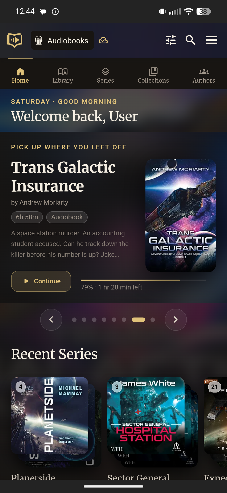
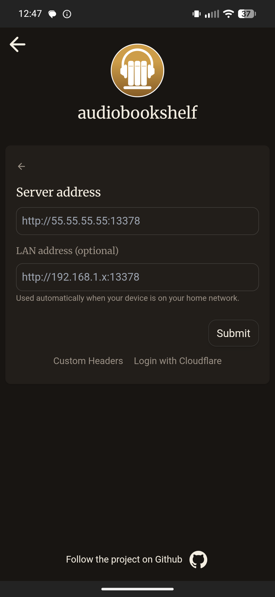
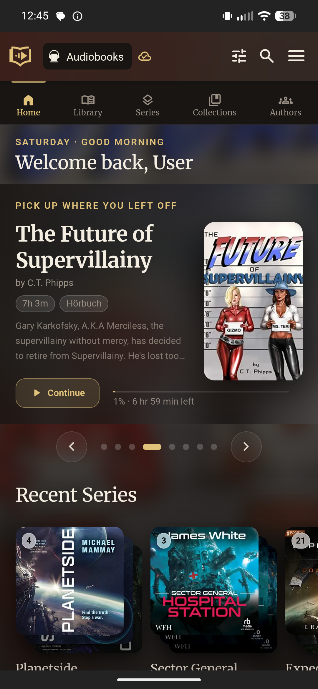
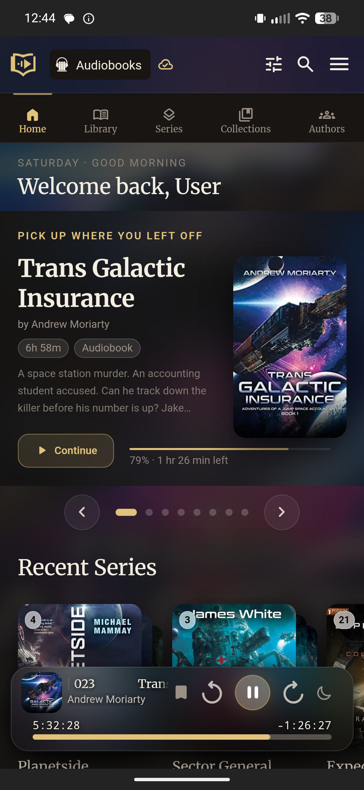
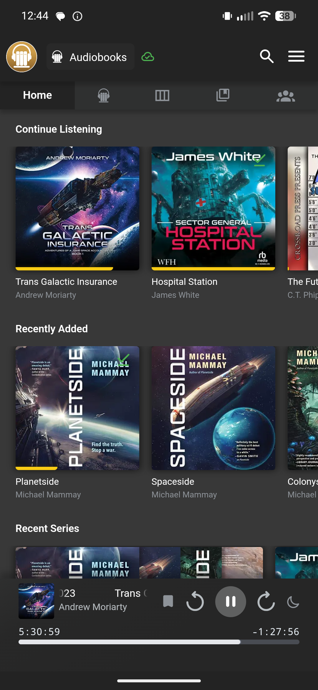
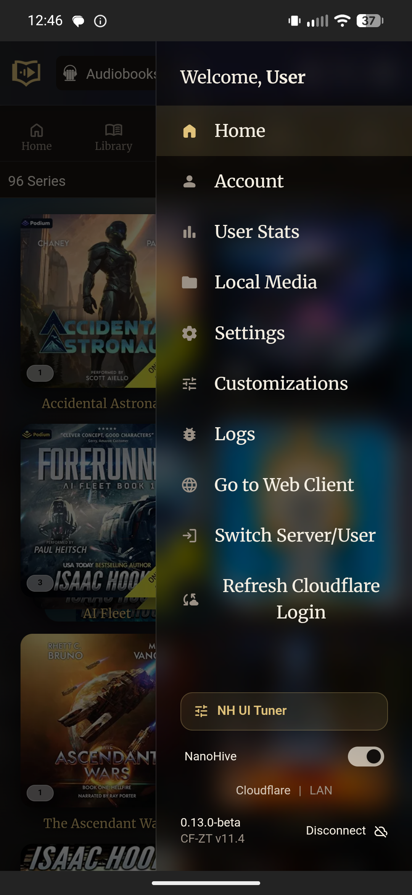
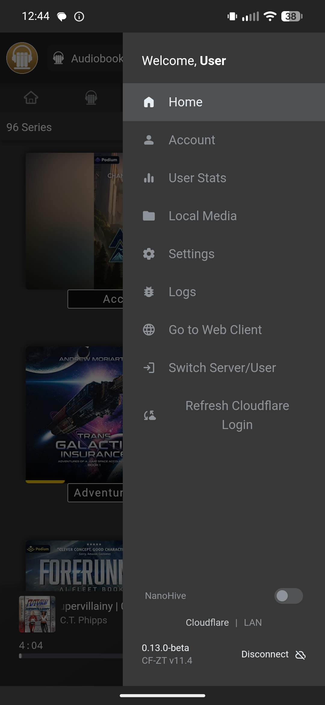
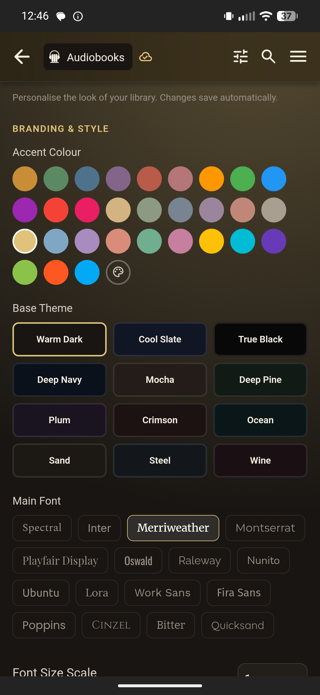

# Audiobookshelf Mobile App — Cloudflare Zero Trust

    

> **This is an unofficial patched build of the [Audiobookshelf Android app](https://github.com/advplyr/audiobookshelf-app).**
> It adds Cloudflare Zero Trust support — both WebView SSO login and manual service token headers — plus LAN address auto-routing for full local network speed at home, encrypted credential storage, and reliable auto-connect on cold start. It also includes the start to a native port of the **[NanoHive](https://github.com/rodzalendo/nanohive-abs-theme)** theme, toggleable per-user — see [NanoHive Theme](#nanohive-theme) below. If NanoHive isn't working just toggle off the setting in the Hamburger menu.
>
> **[⬇ Download the latest signed APK from Releases](https://github.com/claudepc42/audiobookshelf-app-cloudflare-zero-trust/releases/latest)**
>
> ⚠️ Warning ⚠️ **This is the only official repository for this project mod.** A copycat repo using this exact name has been spotted funneling downloads through an **external site** with no real source code behind it
>
>GitHub releases on *this* repo are my only legitimate builds. If you landed here from somewhere else, verify the URL matches `github.com/claudepc42/audiobookshelf-app-cloudflare-zero-trust` before downloading anything. 

---

<table>
<tr>
<td valign="top">

## Contents

<ul>
<li><a href="#whats-patched">What's patched</a>
  <ol>
    <li><a href="#1-cloudflare-zero-trust-webview-sso">Cloudflare Zero Trust WebView SSO</a></li>
    <li><a href="#2-custom-http-headers-service-tokens--advanced">Custom HTTP headers (service tokens / advanced)</a></li>
    <li><a href="#3-auto-connect-on-cold-start">Auto-connect on cold start</a></li>
    <li><a href="#4-automatic-cf-session-expiry-detection--refresh">Automatic CF session expiry detection & refresh</a></li>
    <li><a href="#5-lan-address-auto-routing-home-network-fast-lane">LAN address auto-routing</a></li>
    <li><a href="#6-security-hardening">Security hardening</a></li>
    <li><a href="#7-in-app-update-checker">In-app update checker</a></li>
  </ol>
</li>
<li><a href="#nanohive-theme">NanoHive Theme</a></li>
<li><a href="#installing">Installing</a></li>
<li><a href="#upstream">Upstream</a></li>
<li><a href="#contributing">Contributing</a></li>
</ul>

</td>
<td valign="top" width="355">



</td>
</tr>
</table>

---

## What's patched

### 1. Cloudflare Zero Trust WebView SSO

When you enter a server address and tap **Submit**, the app automatically detects if your server is behind Cloudflare Zero Trust. If detected, an in-app WebView opens, you log in with your Cloudflare identity (Google, Microsoft, GitHub, etc.), and the app captures and stores the session automatically. No manual token entry required.

You can also tap **Login with Cloudflare** below the Submit button to trigger this manually. If your session ever expires, the app detects it and reopens the WebView for a fresh login on its own — see §4.

Session tokens are encrypted at rest, not stored in plaintext — see [Security hardening](#6-security-hardening) below for details.

### 2. Custom HTTP headers (service tokens / advanced)

For service tokens or other header-gated reverse proxies, tap **Custom Headers** below the Submit button to enter headers manually (e.g. `CF-Access-Client-Id` / `CF-Access-Client-Secret`). Headers entered this way skip the WebView SSO detection entirely, and are sent with every request the app makes — login, browsing, streaming, downloads, background sync, and live updates.

### 3. Auto-connect on cold start

Reliably reconnects to your last server on app launch, even if the network comes online right as the app is starting.

### 4. Automatic CF session expiry detection & refresh

Cloudflare sessions expire on a schedule set by your CF Access admin. When that happens, the app detects it and reopens the WebView to refresh automatically — no need to disconnect and reconnect, or even notice it happened.

You can also trigger a refresh manually anytime: side menu (hamburger icon) → **Refresh Cloudflare Login**.

### 5. LAN address auto-routing (home network fast lane)

<p align="center"></p>

When adding or editing a server, an optional **LAN address** field appears below the main server address. Enter your server's local IP (e.g. `http://192.168.1.100:13378`).

When you're home, the app automatically routes streaming and downloads through the LAN address — full local network speed, no Cloudflare overhead, no bandwidth cap. Away from home, it falls back to your main address automatically. One server entry the whole time — no duplicate configs to manage.

Downloads use an in-app client rather than the Android system Download Manager, so they get full LAN speed too instead of being throttled by VPN split-tunneling.

> **Typical result:** streaming and downloads at 50–250 MB/s on a gigabit LAN, automatically, with zero extra setup after the initial field is filled in.

### 6. Security hardening

The LAN probe verifies whatever answers at that address actually looks like an audiobookshelf server before trusting it — so a router admin page or unrelated device squatting on the same IP won't get mistaken for your server. This is a liveness check, not proof of identity: it can't catch someone deliberately spoofing a fake server at your exact known address.

Your Cloudflare session and any custom header tokens are encrypted at rest, and the app disables Android's automatic backup so this data can never end up in a device or cloud backup. This protects against a stolen backup or disk image — not a rooted device or compromised OS.

### 7. In-app update checker

The app checks GitHub for a newer stable release shortly after launch (at most once every 5 days). If one's available, a small dismissible card appears — open the release notes, silence it until the next version, or close it for now. Can be turned off entirely in **Settings → CF Zero Trust**.

---

## NanoHive Theme

<p align="center">
  
  
  
</p>

If NanoHive isn't working just toggle off the setting in the Hamburger menu.

This build includes the start to a native Android port of **[NanoHive](https://github.com/rodzalendo/nanohive-abs-theme)**, a theme for Audiobookshelf created by **[rodzalendo](https://github.com/rodzalendo)**, MIT licensed. All credit for the original design, color palette, and feature concepts belongs to rodzalendo — this is a port, not original design work. Go try NanoHive on your own server — it looks great.

NanoHive normally ships as a reverse proxy that themes the Audiobookshelf **web client**; by its own README, "the ABS mobile apps render natively and are unaffected." Since a mobile app can't be reverse-proxied and themed with injected CSS the way a browser can, this fork ports the same look and feature set natively into the Android app's own UI — each component checked against NanoHive's actual source.

Toggle it on or off anytime from the side menu (hamburger icon → **NanoHive** switch, near the bottom).

### What's included

- 12 base color themes, a full accent-color picker, and 16 selectable fonts — all live in an in-app customization panel (side menu → **Customizations**), no server-side config needed
- A "Pick up where you left off" hero carousel on the home screen — swipeable, with auto-advance, now including podcast libraries
- An expanded **Recent Series** shelf (stock Audiobookshelf caps this shelf at a handful of items)
- Cinematic blurred-cover backgrounds behind the home, item detail, and series detail screens
- Diagonal stacked-cover art for series and collections, with a book-count badge
- Restyled mini player, with touched-up fullscreen player and reader toolbar
- Finished-book badges and reordered metadata on the item detail page
- Book-lookup site buttons on the item page (Amazon per-region, Audible, Goodreads, and more)
- Per-user toggles for which home shelves and side-menu entries are shown
- Autoplay into the next book in a series when the current one finishes (opt-in)
- Cross-library search, with deduplication for items that exist in more than one library
- Reorderable, hideable home shelves
- Narrator pages, mirroring the Authors page
- Tidy Authors, a one-tap cleanup tool for authors with no books attached
- Community ratings & reviews on the item page, a report-a-problem tool, and a server-wide listening ranking on the Stats page — these three require a NanoHive-backed server, not just the theme
- A custom logo and profile photo, either picked from your device or (for admins) uploaded to the server for everyone; any user can opt into the server's shared logo instead of their own

<p align="center">
  
  
</p>

<p align="center">
  
</p>

---

## Installing

1. Download `app-release-signed.apk` from the [Releases page](https://github.com/claudepc42/audiobookshelf-app-cloudflare-zero-trust/releases/latest).
2. If you have the Play Store version or a previous build signed with a different key installed, **uninstall it first** before installing this APK.
3. Allow installation from unknown sources if prompted.

---

## Upstream

This project is built on top of [`advplyr/audiobookshelf-app`](https://github.com/advplyr/audiobookshelf-app) `main`. The patches are designed to re-apply cleanly after upstream updates. See `CUSTOM_HEADERS_DESIGN_DOC.md` for the re-apply guide and full testing checklist.

---

## Original readme

---

Audiobookshelf is a self-hosted audiobook and podcast server.

### Android (beta)

Get the Android app on the [Google Play Store](https://play.google.com/store/apps/details?id=com.audiobookshelf.app)

### iOS (early beta)

**Beta is currently full. Apple has a hard limit of 10k beta testers. Updates will be posted in Discord.**

Using Test Flight: https://testflight.apple.com/join/wiic7QIW **_(beta is full)_**

---

[Go to the main project repo github.com/advplyr/audiobookshelf](https://github.com/advplyr/audiobookshelf) or the project site [audiobookshelf.org](https://audiobookshelf.org)

Join us on [discord](https://discord.gg/pJsjuNCKRq)

**Requires an Audiobookshelf server to connect with**


## Contributing

This application is built using [NuxtJS](https://nuxtjs.org/) and [Capacitor](https://capacitorjs.com/) in order to run on both iOS and Android on the same code base.

### Localization

Thank you to [Weblate](https://hosted.weblate.org/engage/audiobookshelf/) for hosting our localization infrastructure pro-bono. If you want to see Audiobookshelf in your language, please help us localize. Additional information on helping with the translations [here](https://www.audiobookshelf.org/faq#how-do-i-help-with-translations). <a href="https://hosted.weblate.org/engage/audiobookshelf/">  </a>

<details>
<summary>Full dev environment setup — Android (Windows/Mac)</summary>

### Windows Environment Setup for Android

Required Software:

- [Git](https://git-scm.com/downloads)
- [Node.js](https://nodejs.org/en/) (version 20)
- Code editor of choice([VSCode](https://code.visualstudio.com/download), etc)
- [Android Studio](https://developer.android.com/studio)
- [Android SDK](https://developer.android.com/studio)

<details>
<summary>Install the required software with <a href=(https://docs.microsoft.com/en-us/windows/package-manager/winget/#production-recommended)>winget</a></summary>

<p>
Note: This requires a PowerShell prompt with winget installed.  You should be able to copy and paste the code block to install.  If you use an elevated PowerShell prompt, UAC will not pop up during the installs.

```PowerShell
winget install -e --id Git.Git; `
winget install -e --id Microsoft.VisualStudioCode; `
winget install -e --id  Google.AndroidStudio; `
winget install -e --id OpenJS.NodeJS --version 20.11.0;
```


</p>
</details>
<br>

Your Windows environment should now be set up and ready to proceed!

### Mac Environment Setup for Android

Required Software:

- [Android Studio](https://developer.android.com/studio)
- [Node.js](https://nodejs.org/en/) (version 20)
- [Cocoapods](https://guides.cocoapods.org/using/getting-started.html#installation)
- [Android SDK](https://developer.android.com/studio)

<details>
<summary>Install the required software with <a href=(https://brew.sh/)>homebrew</a></summary>

<p>

```zsh
brew install android-studio node cocoapods
```

</p>
</details>

### Start working on the Android app

Clone or fork the project from terminal or powershell and `cd` into the project directory.

Install the required node packages:

```shell
npm install
```

<details>
<summary>Expand for screenshot</summary>


</details>
<br>

Generate static web app:

```shell
npm run generate
```

<details>
<summary>Expand for screenshot</summary>


</details>
<br>

Copy web app into native android/ios folders:

```shell
npx cap sync
```

<details>
<summary>Expand for screenshot</summary>


</details>
<br>

Open Android Studio:

```shell
npx cap open android
```

<details>
<summary>Expand for screenshot</summary>


</details>
<br>

Start coding!

After making changes to the JS layer you need to rebuild the nuxt pages and sync them to the native layers:

```shell
npm run sync
```

</details>

<details>
<summary>Full dev environment setup — iOS (Mac only)</summary>

### Mac Environment Setup for iOS

Required Software:

- [Xcode](https://developer.apple.com/xcode/)
- [Node.js](https://nodejs.org/en/)
- [Cocoapods](https://guides.cocoapods.org/using/getting-started.html#installation)

### Start working on the iOS app

Clone or fork the project in the terminal and `cd` into the project directory.

Install the required node packages:

```shell
npm install
```

<details>
<summary>Expand for screenshot</summary>


</details>
<br>

Generate static web app:

```shell
npm run generate
```

<details>
<summary>Expand for screenshot</summary>


</details>
<br>

Copy web app into native android/ios folders:

```shell
npx cap sync
```

<details>
<summary>Expand for screenshot</summary>


</details>
<br>

Open Xcode:

```shell
npx cap open ios
```

<details>
<summary>Expand for screenshot</summary>


</details>
<br>

Start coding!

After making changes to the JS layer you need to rebuild the nuxt pages and sync them to the native layers:

```shell
npm run sync
```

</details>
